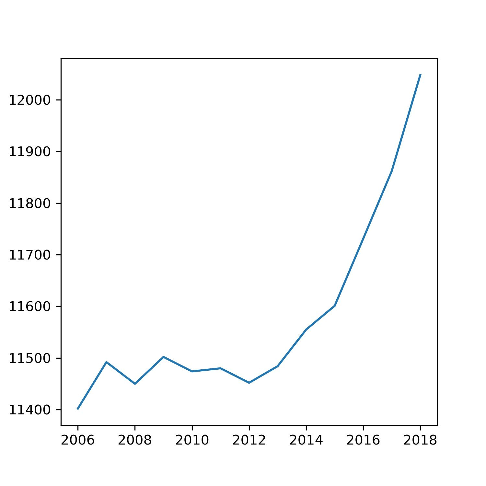

* The Rise of Coccidioides: Forces Against the Dust Devil Unleashed
* An analysis of the forces required to drag sheep over various surfaces
* CORRELATION OF CONTINUOUS CARDIAC OUTPUT MEASURED BY A PULMONARY ARTERY CATHETER VERSUS IMPEDANCE CARDIOGRAPHY IN VENTILATED PATIENTS

Graph of Beer consumption in NL vs Year - 

The Beer consumption is seeing an increasing trend in NL since 2012.

